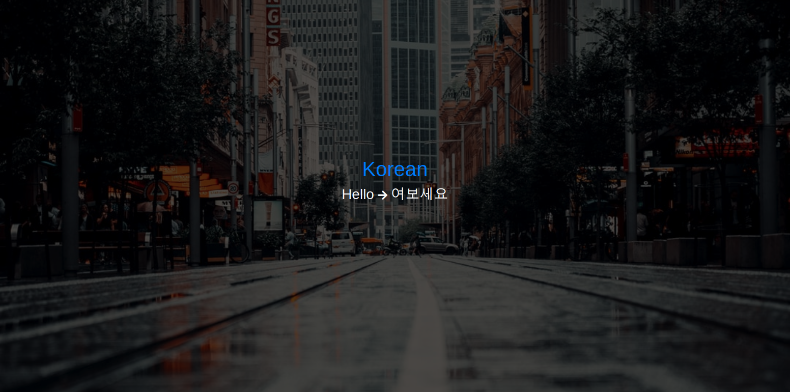

<h1 align="center">Welcome to hello-translated 👋</h1>
<p>
  
</p>

> A fun web app with an API. Translates given string into a random language.

<p align="center"><br><i>Screenshot of the web app, background from Unsplash</i></p>

## Requirements
- Python 3

## Usage

1. Create a `.env` file
   ```env
   TO_TRANSLATE="<the string you want to translate, e.g. hello>"
   ```

2. Install dependencies
   ```sh
   pip install -r requirements.txt
   ```

3. Run
   ```sh
   gunicorn main:app
   ```

## API

Endpoint: `/api`

Response:
```json
{
   "language": {
      "code": "<Language code, e.g. en>",
      "name": "<Language name, e.g. English>",
      "link": "<Wikipedia link>"
   },
   "translation": {
      "original": "<TO_TRANSLATE from .env>",
      "translated": "<Translation>"
   }
}
```